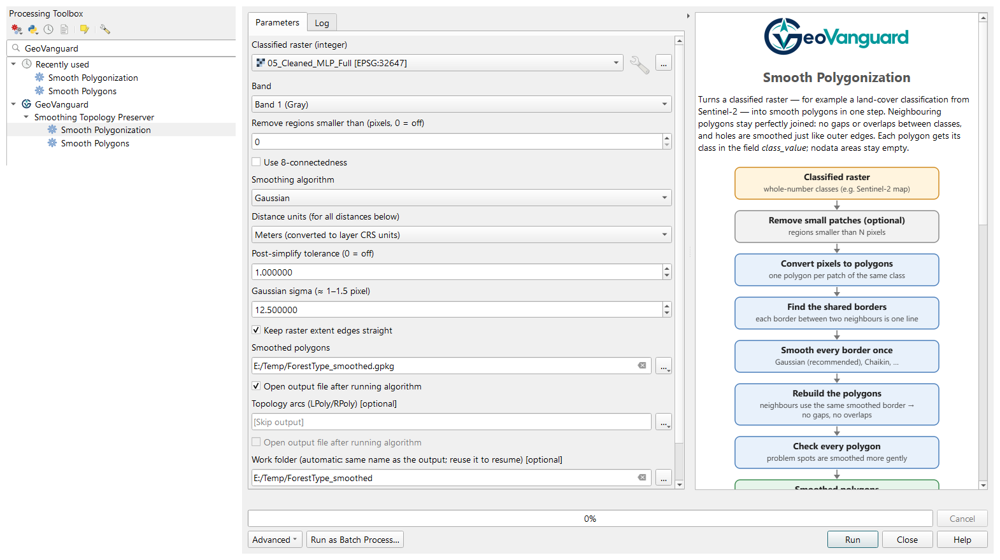
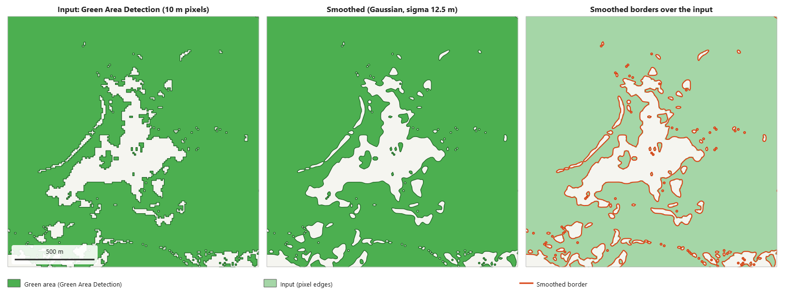
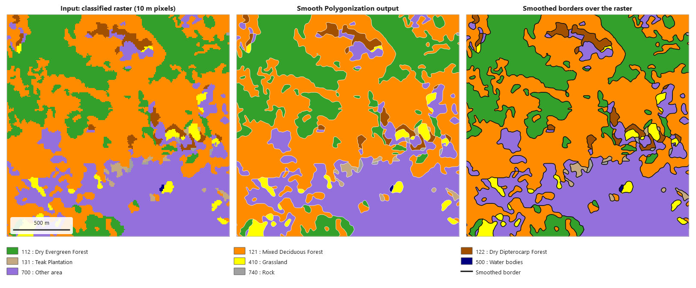
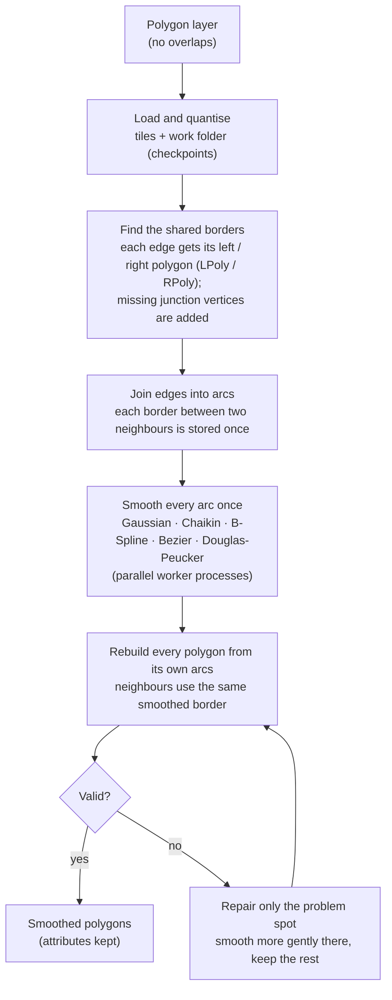
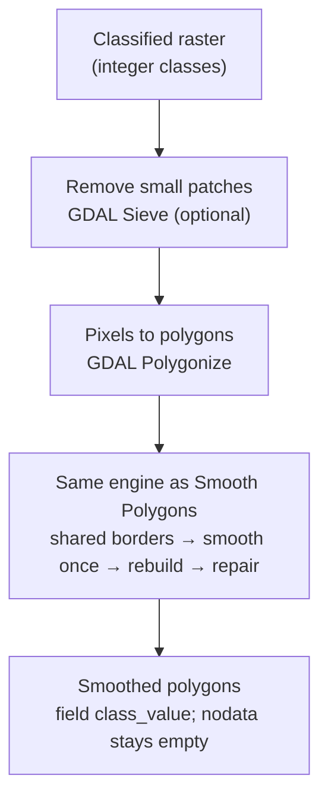

<p align="center"></p>

# GeoVanguard

GeoVanguard helps you process large, complex remote-sensing (RS) and GIS data.
It combines proven open-source components — QGIS, GDAL/OGR, GEOS, NumPy and
SQLite — into efficient workflows that scale to very large datasets: the work is
split into tiles and shared across your CPU cores, it can be paused and resumed,
and an interrupted run continues where it stopped.

GeoVanguard comes in two forms that share one engine and give bit-identical results:

| Form | For | Install | Needs |
| --- | --- | --- | --- |
| **QGIS plugin** `geovanguard_qgis` | QGIS users (Processing Toolbox, models, batch) | QGIS *Plugins › Manage and Install Plugins* › "GeoVanguard" | QGIS 3.40+ or 4.x only |
| **Python package** `geovanguard` | scripts, servers, pipelines | from this repository (`pip`/`conda` packages planned) | Python, numpy, GDAL, shapely ≥ 2 |

## Tools

### Smoothing Topology Preserver

Smooths the jagged outlines of polygon maps — for example land-cover or
forest-type maps made from Sentinel-2 classifications — while neighbouring
polygons stay perfectly joined: no gaps or overlaps appear, holes are smoothed
like outer edges and areas are preserved, also for maps with hundreds of
thousands of polygons.

| Tool | Input | What it does |
| --- | --- | --- |
| **Smooth Polygons** (`geovanguard:smooth_polygons`) | polygon map (vector, no overlaps) | smooths all outlines without gaps or overlaps; attributes are kept |
| **Smooth Polygonization** (`geovanguard:smooth_polygonization`) | classified (integer) raster | optional removal of small patches → pixels to polygons → the same smoothing |

Smoothing methods, best first: Gaussian (recommended), Chaikin, B-Spline, Bezier,
Douglas-Peucker. Defaults suit 10 m Sentinel-2 maps; distances are in meters.

Developed by **Pisut Nakmuenwai** · License: [GPL-2.0-or-later](LICENSE) ·
cite with [CITATION.cff](CITATION.cff).

## Screenshot

Processing Toolbox › **GeoVanguard › Smoothing Topology Preserver**, and the
*Smooth Polygonization* dialog. The work folder is filled in from the output name;
the help panel shows the workflow of the tool. While a job runs, a **Pause /
Resume** button appears next to *Cancel*.

<p align="center"></p>

## Examples

### Single class — Green Area Detection

Polygons of a Green Area Detection result (10 m pixels, outer boundaries and
holes). Left: the input with its pixel staircase; middle: smoothed with the
defaults (Gaussian, sigma 12.5 m); right: the smoothed borders drawn over the
input — the outer edges and the holes are smoothed alike and the total area is
preserved.

<p align="center"></p>

### Multiple classes — Forest Type

*Smooth Polygonization* of a forest-type classification (raster 28,286 × 16,911
pixels, 10 m). Left: the classified raster; middle: the smoothed polygons;
right: the smoothed borders over the raster. Every border between two classes is
one shared line, so the classes stay exactly joined — no gaps, no overlaps. The
full map gave 385,679 valid polygons (no repair needed) in 17.6 minutes with
7 worker processes on a 12-core PC.

<p align="center"></p>

## Workflow

### Smooth Polygons



### Smooth Polygonization



## How it works

1. **Shared borders, stored once.** Polygons go into an on-disk work database
   (SQLite) with a global `poly_id`. Tile by tile, every boundary edge is matched
   with its reverse edge, so each edge knows the polygon on its left (LPoly) and
   on its right (RPoly). Junction vertices that GDAL leaves out (where three
   polygons meet on a straight edge) are inserted first. Edges with the same
   LPoly/RPoly are joined into *arcs*: one arc per border between two neighbours.
2. **Smooth each arc once.** Every arc is smoothed exactly once, so the two
   polygons on either side receive the same new line. The Gaussian method
   corrects the area of closed rings; arcs at the raster edge can stay straight.
3. **Rebuild from arcs.** Each polygon is rebuilt by walking its arcs (forward
   where it is the LPoly, reversed where it is the RPoly). Holes and outer
   boundaries are handled the same way.
4. **Local repair.** If a rebuilt polygon would be invalid (a smoothed arc
   crossing another), only a window around the crossing is smoothed more gently;
   the rest keeps the full smoothing. The neighbours are rebuilt with the same line.
5. **Large data.** Memory is bounded by the tile size; the tile and batch stages
   run in parallel worker processes (by default 50–75 % of the idle CPU cores),
   with results bit-identical to a single-process run. Every stage checkpoints
   to the work folder: a cancelled run resumes, changing only the smoothing
   settings re-uses the topology, and **Pause / Resume** frees the CPU of a
   multi-day job for a while.

Diagram of the full pipeline: [WorkFlow.svg](WorkFlow.svg) (source: [WorkFlow.mmd](WorkFlow.mmd)).

## Comparison with other tools

| | QGIS *Smooth* | GRASS *v.generalize* | Mapshaper | ArcGIS Pro *Smooth Shared Edges* | **GeoVanguard** |
| --- | --- | --- | --- | --- | --- |
| Shared borders between neighbours | each feature smoothed on its own → gaps / overlaps between neighbours | shared boundaries of the GRASS topological vector model | shared arcs | shared edges | shared arcs (LPoly/RPoly), stored once |
| Curve smoothing | Chaikin-type smoothing | several smoothing and simplification algorithms | simplification only (no curve smoothing) | PAEK / Bezier smoothing | Gaussian (area-corrected), Chaikin, B-Spline, Bezier; Douglas-Peucker |
| Workflow | any QGIS layer | data imported into a GRASS database and exported again | command line / web, data in memory | commercial licence | QGIS layers and files directly; raster → smooth polygons in one tool |
| Resume after an interruption, pause / resume | no | no | no | no | yes — tiles + on-disk work folder, parallel worker processes |
| Polygons that would become invalid | — | — | — | — | repaired locally, neighbours rebuilt with the same line |

GRASS *v.generalize* is the closest open-source equivalent; GeoVanguard adds a
one-step raster workflow, area-corrected Gaussian smoothing, local repair and the
large-data machinery (tiles, parallel workers, checkpoints, pause / resume), and
needs nothing beyond QGIS. "—": not compared here; see each tool's documentation.

## Standalone use

Until the `pip`/`conda` packages are published, put the repository folder on
`PYTHONPATH` (any Python with numpy, GDAL and shapely ≥ 2, e.g. the OSGeo4W or
conda-forge Python).

```python
import geovanguard as gv
gv.smooth_polygons('coverage.gpkg', 'smoothed.gpkg')                     # Gaussian, sigma 12.5 m
gv.smooth_polygonization('classified.tif', 'smoothed.gpkg', sieve=4,
                         algorithm='Chaikin', work_dir='work/forest')    # resumable
```

All distances are in meters (converted to the layer CRS) unless `units='crs'`.
Progress on the console: pass `feedback=geovanguard.feedback.ConsoleFeedback()`.

## Requirements

- **Plugin:** QGIS 3.40+ or 4.x (tested on 3.40.7 and 4.2.2). Only what ships with
  QGIS is used: `qgis.core`, GDAL/OGR, numpy, sqlite3; the engine is bundled in
  the plugin ZIP.
- **Standalone:** numpy, GDAL Python bindings (`osgeo`), shapely ≥ 2.
- `scipy` is optional (B-Spline/Bezier fall back to Chaikin without it).

## Development

```powershell
powershell -ExecutionPolicy Bypass -File tools\install_plugin.ps1   # junctions into QGIS 3 + 4 profiles
powershell -ExecutionPolicy Bypass -File tools\package_plugin.ps1   # dist\geovanguard_qgis-<version>.zip
```

The plugin imports the engine from its sub-folder `geovanguard_qgis/geovanguard`,
a junction to `geovanguard/` while developing (git-ignored) and a copy in the ZIP.
Then enable **GeoVanguard** in *Plugins › Manage and Install Plugins*.

## Tests

```powershell
$q = "C:\Program Files\QGIS 4.2.2\bin\python-qgis.bat"
& $q tests\test_core.py                 # numpy only
& $q tests\run_qgis_tests.py            # plugin end-to-end
& $q tests\run_gui_test.py              # Processing dialog
cd tests; & $q result_hashes.py plugin.json                          # exact result fingerprints
& $q standalone_hashes.py sa.json --compare plugin.json              # standalone == plugin, no qgis import
```

## Layout

```text
geovanguard/          standalone engine (numpy + sqlite; GEOS via backends/) — never imports qgis
  core/               geometry encoding, topology (LPoly/RPoly), smoothing, work store
  backends/           GeometryBackend interface + shapely backend
  pipeline.py api.py params.py progress.py feedback.py raster.py
geovanguard_qgis/     QGIS plugin: Processing provider, algorithms, GUI wrappers, QGIS backend
tests/                core, end-to-end, GUI and parity tests
tools/                install / package / ZIP check helpers
```
